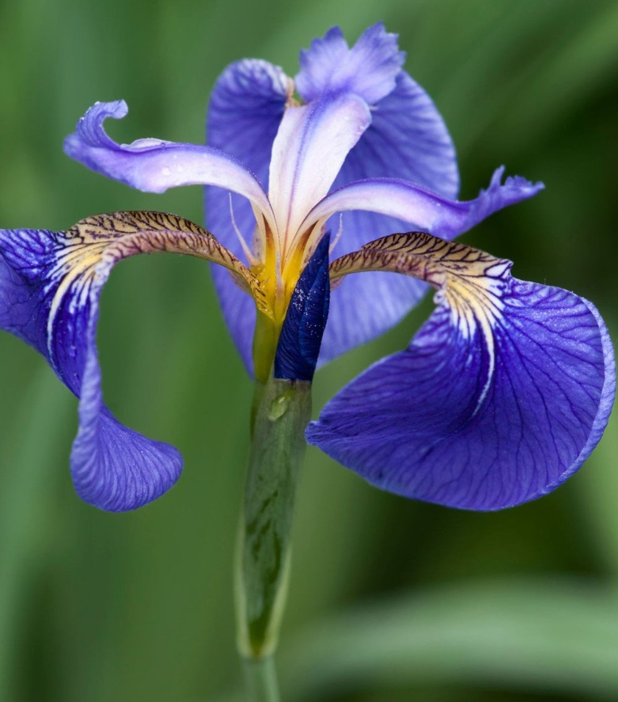

# CSI-Assignment---Week-7
# 🌼 Iris Flower Classification Web App

Welcome to my **ML model deployment project** created as part of the **Celebal Summer Internship – Assignment 7**.  
This project showcases how to train and deploy a machine learning model using **Streamlit**, providing an interactive and visually rich experience.

---
## 📌 Project Overview

This web app allows users to:

- Input custom measurements for an Iris flower (sepal and petal dimensions)
- Receive real-time predictions on the flower species
- Visualize the predicted Iris class using actual flower images
- Download prediction results as a CSV file
- Track prediction history in-session
- Reset the session state when needed

> ✅ Deployed using: **Streamlit**  
> ✅ Model used: **Logistic Regression** (trained on Scikit-learn’s Iris dataset)  
> ✅ Language: **Python**  
> ✅ Frameworks: **Scikit-learn, Pandas, Streamlit**

---

## 📁 Project Structure
```
streamlit_ml_deploy
├── app.py                  # Streamlit web app
├── train_model.py          # Trains and saves the ML model
├── model.pkl               # Pre-trained model file
├── requirements.txt        # Dependencies list
├── README.md               # Project documentation
└── images/                 # Iris species image previews
    ├── setosa.jpg
    ├── versicolor.jpg
    └── virginica.jpg

```
---

## 🚀 Features That Make It Stand Out

- 🌈 **Stylish Prediction Card** — visually highlights the predicted class  
- 🖼 **Dynamic Image Preview** — displays a real flower image based on the prediction  
- 🧾 **Downloadable Results** — export your predictions in one click  
- 🧠 **Session-based History Tracking** — see past predictions without refresh  
- 🔄 **Reset Button** — clear history easily for new testing

---

## 🧠 Model Details

- **Dataset**: [Iris Dataset](https://scikit-learn.org/stable/auto_examples/datasets/plot_iris_dataset.html)
- **Model**: Logistic Regression
- **Features**:
  - Sepal Length
  - Sepal Width
  - Petal Length
  - Petal Width
- **Target Classes**:
  - Setosa
  - Versicolor
  - Virginica

---

## 📷 Demo Preview

  
*Above: Example of prediction and image display for Iris Setosa*

---

## 🛠️ How to Run the Project Locally

To run this Iris classification Streamlit app on your local machine, follow the steps below:

### 1. Download or Copy the Project

First, download the project files as a ZIP from GitHub and extract them, or copy them manually to a folder on your system.

### 2. (Optional but Recommended) Create a Virtual Environment

Creating a virtual environment helps isolate project dependencies.

On **Windows**:

```bash
python -m venv venv
venv\Scripts\activate
```
On **macOS/Linux**:
```bash
python3 -m venv venv
source venv/bin/activate
```
### 3. Install Required Dependencies
Use the requirements.txt file to install all necessary packages:

```bash
pip install -r requirements.txt
```
### 4. Train the Machine Learning Model
Run the training script to generate the model.pkl file:

```bash
python train_model.py
```

### 5. Launch the Streamlit Web App
Start the web application using Streamlit:

```bash
streamlit run app.py
```

After a few seconds, your default browser will open with the app running at:

```arduino
http://localhost:8501
```

You're now ready to interact with the app and make predictions!

